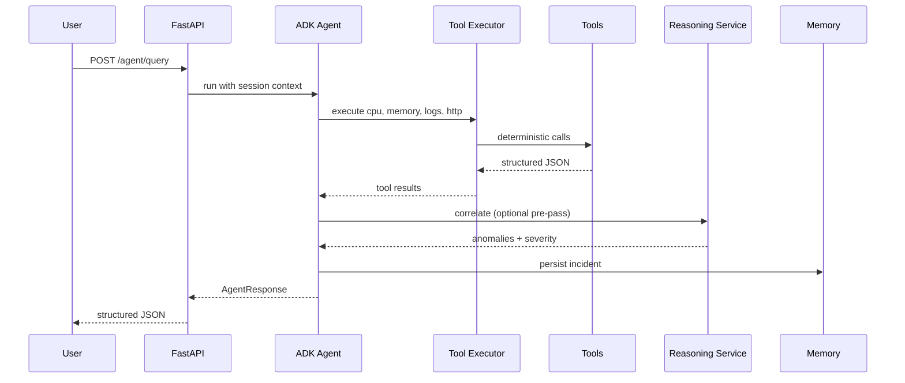

# Architecture — Server Health Monitoring Agent

## High-Level Overview

```
┌─────────────────────────────────────────────────────────────────────────┐
│                         Client (React / curl / CLI)                     │
└─────────────────────────────────┬───────────────────────────────────────┘
                                  │ HTTP
┌─────────────────────────────────▼───────────────────────────────────────┐
│                          FastAPI (api/)                                 │
│  /health  /metrics  /logs  /agent/query  /analyze  /incidents           │
└─────────────────────────────────┬───────────────────────────────────────┘
                                  │
        ┌─────────────────────────┼─────────────────────────┐
        │                         │                         │
        ▼                         ▼                         ▼
┌───────────────┐        ┌────────────────┐        ┌──────────────┐
│ Agent Layer   │        │ Services Layer │        │ Memory Layer │
│ (Google ADK)  │◄──────►│ anomaly, logs, │◄──────►│ SQLite       │
│ planner,      │        │ incidents      │        │ short + long │
│ reasoning     │        └────────┬───────┘        └──────────────┘
└───────┬───────┘                 │
        │                         │
        ▼                         ▼
┌───────────────────────────────────────────────────────────────────────┐
│                         Tools Layer (deterministic)                   │
│  cpu │ memory │ disk │ network │ process │ uptime │ ping │ http │     │
│  port │ ssl │ dns │ db │ service │ log_analyzer                       │
└───────────────────────────────────────────────────────────────────────┘
                                  │
                                  ▼
                    ┌─────────────────────────┐
                    │  Host OS / psutil /     │
                    │  requests / log files   │
                    └─────────────────────────┘
```

## Component Responsibilities

### 1. Planner (`agents/planner.py`)

- Parses user intent from natural language
- Selects tool sequence (delegated to ADK agent instruction + tool schemas)
- Returns execution plan metadata for observability

### 2. Tool Executor (`agents/executor.py`)

- Wraps tool calls with timing, request ID, error handling
- Records execution history for tracing
- Never swallows failures silently — propagates structured errors

### 3. Memory Layer (`memory/`)

| Type | Storage | Contents |
|------|---------|----------|
| Short-term | In-memory session dict | Conversation turns, latest observations |
| Long-term | SQLite | Incidents, recommendations, metric snapshots |

### 4. Reasoning Layer (`services/anomaly.py`, `services/reasoning.py`)

- **Deterministic**: threshold checks, spike detection, trend comparison
- **LLM synthesis**: correlates tool outputs into explanations (ADK agent)
- Outputs `SeverityLevel`: INFO | WARNING | CRITICAL

### 5. Response Generator (`agents/response.py`)

- Maps internal `AnalysisResult` → `AgentResponse`
- Enforces Facts / Possible explanations / Confidence / Recommended actions format

## Data Flow — "Why is performance degrading?"



## Design Principles

| Principle | Implementation |
|-----------|----------------|
| Tools ≠ Agent logic | Tools in `tools/`, zero LLM imports |
| Structured outputs | Pydantic models everywhere |
| Minimize hallucination | Agent instruction: only cite tool data |
| Observability | structlog + request_id + tool_history table |
| Extensibility | `BaseTool` protocol, config-driven endpoints |
| Testability | Tools mockable; services unit-tested |

## Future Extensions (hooks prepared)

- `services/notifications/` — Slack, email, Telegram adapters
- `tools/k8s.py`, `tools/docker.py` — container orchestration
- `tools/multi_host.py` — agent fleet monitoring
- PostgreSQL via `DATABASE_URL` env swap
